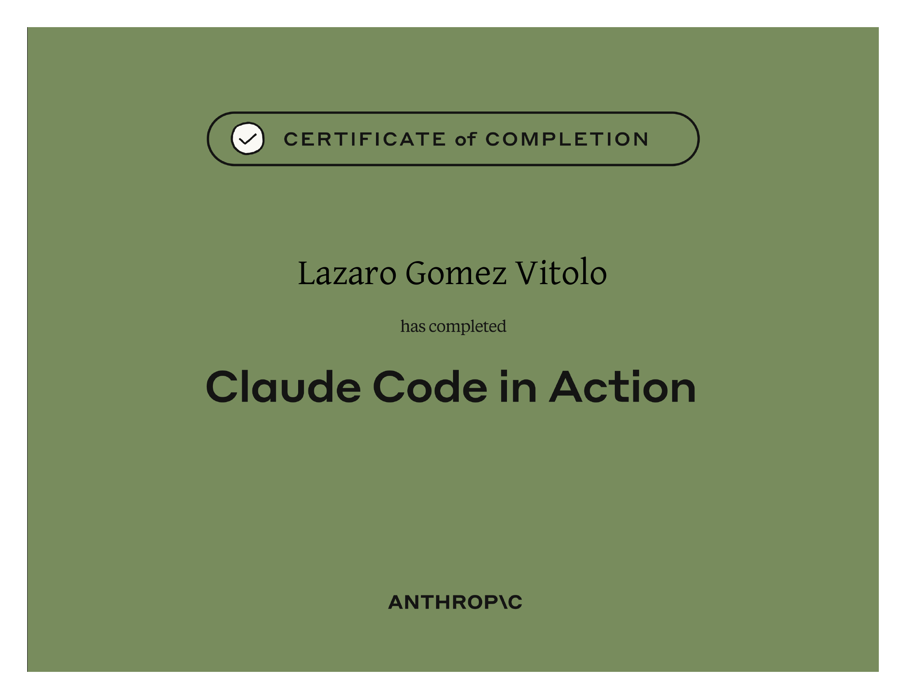
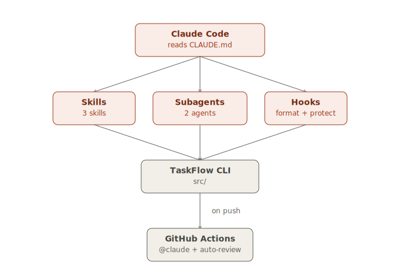

# 🤖 claude-code-starter

A minimal task-tracker CLI wired up with Claude Code's full toolkit — skills, subagents, hooks, and GitHub Actions — built while completing Anthropic Academy's **Claude Code in Action** course.

  

---

## 🎓 Certification



Completed **Claude Code in Action** on Anthropic Academy.
📄 [View the certificate (PDF)](certificate/Claude_Code_in_Action.pdf)

This is the last course in a five-part learning path — see [🌱 Learning path](#-learning-path) below.

---

## 📖 About

TaskFlow itself is deliberately tiny (`add` / `done` / `list`) — it exists mostly as something for Claude Code to operate on. The actual content of this repo is the `.claude/` configuration around it:



| Feature                                                   | Where                                     |
| --------------------------------------------------------- | ----------------------------------------- |
| Skills — `/review`, `/test`, `/changelog`                 | `.claude/skills/`                         |
| Subagents — `code-reviewer`, `test-writer`                | `.claude/agents/`                         |
| Hooks — auto-format on save, protect `certificate/`       | `.claude/settings.json`, `.claude/hooks/` |
| GitHub Actions — `@claude` mentions + automated PR review | `.github/workflows/`                      |
| Project memory                                            | `CLAUDE.md`                               |

## 🚀 Getting started

```bash
npm install

npm run dev -- add "write the README"
npm run dev -- list
npm run dev -- done 1
```

```bash
npm test       # run the unit tests
npm run build  # compile to dist/
npm run lint   # check formatting
```

## 🛠️ Claude Code setup

### Skills

Custom commands live under `.claude/skills/<name>/SKILL.md` — each one becomes a `/name` command Claude can also invoke on its own unless marked manual-only.

- **`/review`** — reviews the uncommitted diff against `CLAUDE.md`'s conventions before you commit
- **`/test`** — runs the suite and fixes failures itself
- **`/changelog [version]`** — drafts a `CHANGELOG.md` entry from recent commits. Manual-only (`disable-model-invocation: true`) — you don't want Claude deciding on its own that it's release time

### Subagents

Defined in `.claude/agents/`, each runs in its own context window so verbose output doesn't clutter the main conversation:

- **`code-reviewer`** — read-only, checks quality/security/tests after a change
- **`test-writer`** — writes missing unit tests for new functions in `src/tasks.ts`

### Hooks

Configured in `.claude/settings.json`, scripts in `.claude/hooks/`. Both read the hook's JSON payload from stdin with `jq`, so it needs to be on `PATH` (`apt install jq` / `brew install jq`):

- `PostToolUse` → auto-formats any file Claude edits or writes with Prettier
- `PreToolUse` → denies edits to `certificate/`, regardless of how politely Claude is asked

### GitHub Actions

Both workflows need an `ANTHROPIC_API_KEY` repository secret ([setup guide](https://docs.claude.com/en/docs/claude-code/github-actions)):

- **`.github/workflows/claude.yml`** — responds to `@claude` mentions on issues and PR comments
- **`.github/workflows/pr-review.yml`** — checks out the repo, then runs the `/review` skill from this repo on every opened or updated PR

## 🌱 Learning path

Part of a repo-per-course series from Anthropic Academy's free tier — each course gets its own starter repo instead of stopping at the certificate:

1. Claude 101(tutorial)
2. Building with the Claude API → [`claude-api-starter`](https://github.com/lazaro549/claude-api-starter)
3. Model Context Protocol: Advanced Topics → [`mcp-advanced-starter`](https://github.com/lazaro549/mcp-advanced-starter)
4. **Claude Code in Action → this repo** 🎓

Full portfolio: [lazaro549.github.io/Portafolio](https://lazaro549.github.io/Portafolio/)

## 📜 License

MIT — see [LICENSE](LICENSE).

## 💸 Donations

If you'd like to support this project:

- 🇦🇷 ARS (Argentina)<br>Alias: `lazaro.503.alaba.mp`
- 🌎 USD (Argentina only, local transfers)<br>Alias: `ahogada.duras.foca`

---

⭐ Star this if the `.claude/` setup is useful as a reference for your own projects.
